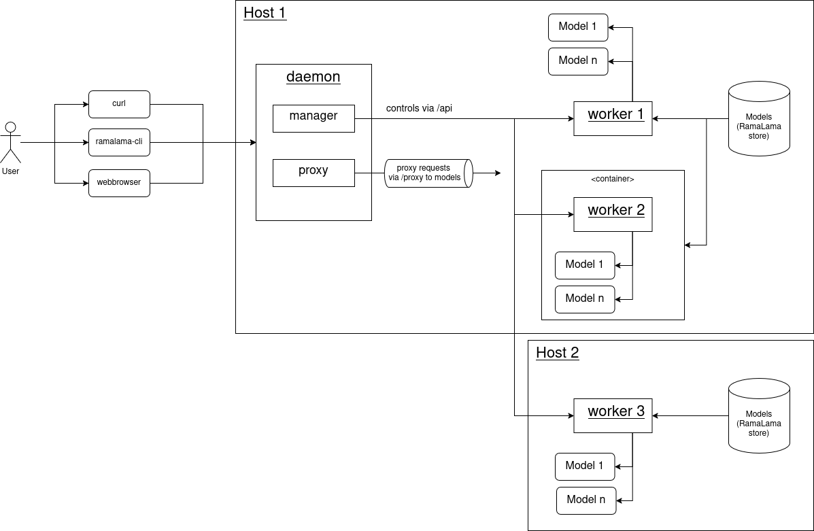

# ramalama-daemon

Proposal on how to split [RamaLama](https://github.com/containers/ramalama) into multiple components:

- daemon
- worker
- cli

This is roughly depicted in the following diagram:



## Running the proposal

1. Start the daemon:
```bash
$ PYTHONPATH=. ./daemon/server.py --port 8070
```

2. Start the (local) worker:
```bash
$ PYTHONPATH=. ./worker/server.py --daemon-port 8070
```

3. Open the webbrowser at `http://localhost:8070/`. You should see a list of the registered, local worker and all available models. By clicking on a `Start`-button, the model can be run. 

## Generating OpenAPI clients

First, install OpenAPI spec to python client:
```bash
$ npm install @openapitools/openapi-generator-cli -g
```

Then run

```bash
$ make generate
```
